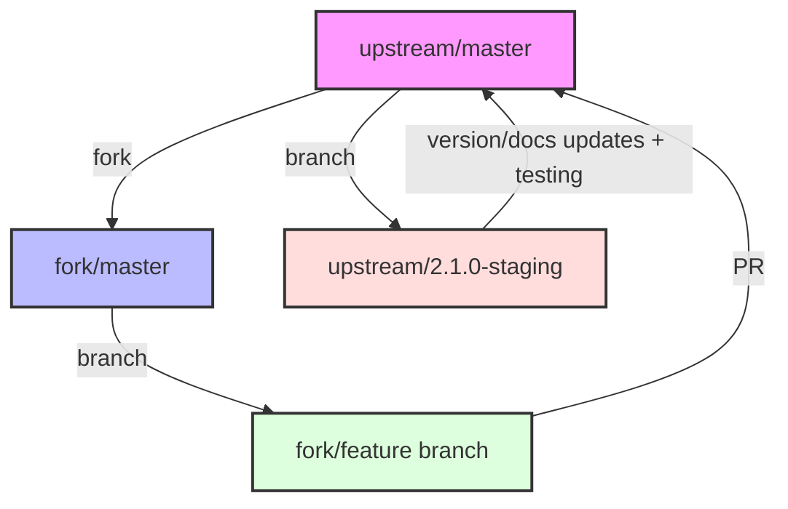

# Development Guide

[](https://github.com/libnano/primer3-py/actions/workflows/test.yml)
[](https://github.com/libnano/primer3-py/actions/workflows/docs.yml)
[](https://github.com/libnano/primer3-py/actions/workflows/release.yml)

Thank you for your interest in contributing to primer3-py! This document provides comprehensive guidelines for development, contribution, and release processes.

## Development Environment Setup

Development requires Python 3.8+ and the development dependencies listed in `dev-requirements.txt`.

1. Set up your Python environment:
   ```console
   $ pip install -r dev-requirements.txt
   ```

2. Install pre-commit hooks:
   ```console
   $ pre-commit install
   ```

## Development Workflow

We use a fork-based development workflow:

1. Fork the repository on GitHub

2. Clone your fork:
   ```console
   $ git clone git@github.com:username/primer3-py.git
   $ cd primer3-py
   ```

3. Add upstream remote:
   ```console
   $ git remote add upstream git@github.com:libnano/primer3-py.git
   ```

4. Create a feature branch:
   ```console
   # Create a feature, fix, or docs branch
   $ git checkout -b feat/my-feature
   ```

5. Make your changes, following our [coding standards](#coding-standards)

6. Run tests and checks:
   ```console
   # Run the test suite
   $ pytest

   # Run all pre-commit hooks
   $ pre-commit run -a
   ```

7. Push changes and open a PR

## Branching Strategy

We follow a fork-based development model with version-specific staging branches:



### Branch Types

1. **Main Branch** (`master`):
   - Primary development branch
   - All features and fixes merge here first
   - Always contains the latest development code

2. **Staging Branches** (e.g., `2.1.0-staging`):
   - Created for each version being prepared for release
   - Used for version-specific changes and testing
   - Named according to the target version (e.g., `2.1.0-staging`)
   - Merged back to master after successful release

3. **Feature Branches**:
   - Created in personal forks
   - Used for developing new features or fixes
   - Should have descriptive names (e.g., `feat/pin_cython`, `fix/formamide_conc`)
   - Submit PRs from these branches to upstream master

### Workflow Details

1. **Feature Development**:
   - Fork the repository
   - Create feature branch from master
   - Develop and test changes
   - Submit PR to upstream master

2. **Release Preparation**:
   - Create version-specific staging branch from master
   - Make version/documentation updates
   - Perform testing and validation
   - Merge back to master when ready

3. **Maintenance**:
   - Keep your fork's master in sync with upstream
   - Rebase feature branches on latest master when needed
   - Clean up branches after merging

## Continuous Integration

We use GitHub Actions for CI/CD. Three main workflows are available:

### Test Workflow (`test.yml`)
- Runs on every push and PR
- Builds the package
- Runs all tests
- Runs pre-commit hooks
- Manual trigger available via workflow_dispatch

### Documentation Workflow (`docs.yml`)
- Builds Sphinx documentation
- Publishes to gh-pages on version tags
- Publishes to gh-pages-test on doc branches
- Manual builds available with branch selection
- Requires PRIMER3_TOKEN secret for publishing

### Release Workflow (`release.yml`)
- Builds wheels for all supported Python versions
- Builds source distribution
- Validates versions against __init__.py
- Supports test builds (.devN) and production (.postN)
- Manual trigger with test/production options

## Pull Request Guidelines

1. PR Description:
   - Use clear, descriptive titles
   - Reference related issues
   - Describe all significant changes
   - Use markdown for code blocks

2. Code Requirements:
   - Add tests for new functionality
   - Update documentation as needed
   - Follow existing code style
   - Keep changes focused and atomic

3. Review Process:
   - Address all CI failures
   - Respond to reviewer feedback
   - Rebase if needed for clean history
   - Squash commits if requested

## Coding Standards

1. Python Code:
   - Follow PEP 8
   - Always use type hints for function parameters and return values
   - Document public APIs
   - Keep functions focused and testable
   - Respect 80 character line length limit
   - Review and follow `setup.cfg` linter configuration
   - Always run pre-commit hooks before committing:
     ```console
     # Run all pre-commit hooks on all files
     $ pre-commit run -a
     ```

2. Cython Code:
   - Follow Python conventions where applicable
   - Document complex algorithms
   - Optimize only with benchmarks

3. Documentation:
   - Use clear, concise language
   - Include code examples
   - Keep API docs up to date
   - Follow Google docstring style

## Version Numbers

Primer3-py follows [PEP 440](https://peps.python.org/pep-0440/) versioning conventions. The version number is maintained in a single source of truth: `primer3/__init__.py`.

### Version Format Types

1. **Release versions** (e.g., `2.1.0`):
   - Standard format: `X.Y.Z` (major.minor.patch)
   - Used for stable releases
   - Stored in source code and git tags

2. **Pre-release versions** (e.g., `2.1.0a1`, `2.1.0b1`, `2.1.0rc1`):
   - Used for feature-complete code that needs testing
   - Alpha (`a`): Early testing, expect bugs
   - Beta (`b`): Feature complete, testing for bugs
   - Release Candidate (`rc`): Final testing before release
   - Stored in source code and git tags

3. **Development builds** (e.g., `2.1.0.dev1` or `2.1.0a1.dev1`):
   - Added automatically by CI/CD for test builds
   - NOT stored in source code
   - Used for testing package builds on TestPyPI
   - Can be combined with pre-releases

4. **Post-releases** (e.g., `2.1.0.post1`):
   - Added automatically by CI/CD for production rebuilds
   - Used when fixing packaging/build issues only
   - NOT stored in source code
   - Source remains unchanged from base version

### Version Number Guidelines

- Source code version (in `__init__.py`): Always use base version (`X.Y.Z` or pre-release like `X.Y.Za1`)
- Git tags: Must be prefixed with 'v' and match source code version exactly (e.g., `v2.1.0`)
- Test builds: CI/CD automatically adds `.devN` suffix
- Production rebuilds: CI/CD automatically adds `.postN` suffix if needed

## Release Process

### 1. Preparing a Release

1. Update version in `__init__.py` to target version
2. Update `CHANGES` file:
   - Add new version section at the top with release date
   - List all significant changes since the last release, ensuring each entry:
     - Matches corresponding PR descriptions
     - References related issue numbers (e.g., "Fix formamide concentration (issue #140)")
     - Groups changes by type (e.g., Features, Bug Fixes, Documentation)
3. Update copyright end dates in source files if needed (e.g., `__init__.py`)
4. For pre-releases, use appropriate suffix:
   ```python
   __version__ = "2.1.0a1"  # Alpha release
   __version__ = "2.1.0b1"  # Beta release
   __version__ = "2.1.0rc1"  # Release candidate
   ```
5. Commit changes and push to GitHub

### 2. Testing Releases

1. Go to GitHub Actions → Release workflow
2. Click "Run workflow"
3. Configure:
   - Set "Push to TestPyPI" to `true`
   - Set "Build number" (increments `.devN` suffix)
4. Review build logs and test on TestPyPI
5. Go to GitHub Actions → Docs workflow
6. Click "Run workflow" and select your branch
7. Review the documentation build for any errors
8. Test the documentation locally if needed
9. Repeat with incremented build numbers if needed

### 3. Production Release

1. Go to GitHub Actions → Release workflow
2. Click "Run workflow"
3. Configure:
   - Set "Push to TestPyPI" to `false`
   - Set "Build number" to `1` for first attempt
4. If build fails due to packaging (not code):
   - Increment build number
   - CI/CD will add `.postN` suffix automatically
5. Go to GitHub Actions → Docs workflow
6. Click "Run workflow" and select your branch
7. Verify the documentation builds and deploys successfully
8. After successful release:
   - For pre-releases (alpha/beta/rc):
     ```console
     # Tag and push an alpha/beta/rc release
     $ git tag v2.1.0a1
     $ git push origin v2.1.0a1
     ```
   - For full releases:
     - Create a new GitHub release at https://github.com/libnano/primer3-py/releases/new
     - Tag version: `v2.1.0` (use actual version number)
     - Title: `v2.1.0` (use actual version number)
     - Description: Copy the relevant section from CHANGES as the release description
     - This will automatically create and push the git tag

### When to Use Each Version Type

1. **Version Number Components** (X.Y.Z):
   - **Major (X)**: Breaking API changes including:
     - Removal of package functions
     - Changes to function parameters
     - Changes to function output formats
     - Core algorithm changes
   - **Minor (Y)**: New features and functionality in a backward-compatible manner
   - **Patch (Z)**: Backward-compatible bug fixes and minor improvements

2. **Pre-releases** (`a`/`b`/`rc`):
   - Used when you want to publicly test a new version before final release
   - Particularly important for major version changes
   - Allows community testing while indicating the code is not yet production-ready

3. **Development builds** (`.devN`):
   - For testing the complete build and distribution system
   - Verifying packaging on TestPyPI
   - CI/CD pipeline verification
   - Not for production use

4. **Post-releases** (`.postN`):
   - Fix packaging issues
   - No code changes
   - Build environment issues

## Getting Help

- Open an issue for bugs or feature requests
- Join discussions in existing issues
- Contact maintainers for guidance
- Check documentation for common solutions

## License

By contributing, you agree that your contributions will be licensed under the GPLv2 License.
