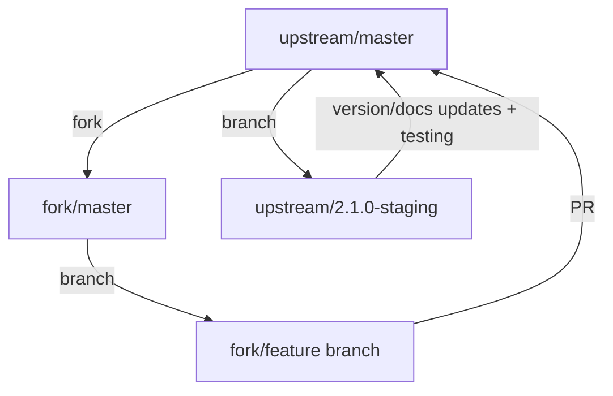

# Getting Started

**Primer3-py** is designed to be simple to install and use.

```{contents}
```

## Requirements

**Primer3-py** is built and tested on MacOS, Linux and Windows 64-bit systems; we do not provide official Windows support. Python versions 3.8 - 3.13 builds are supported.

Wheels are released for CPython versions following the [EOL model](https://devguide.python.org/versions/).


## Installation

If you want to install the latest stable build of **Primer3-py**, you can
install it using `pip`:

```bash
$ pip install primer3-py
```

**NOTE**: We support wheel builds for PyPi for the 3 most recent CPython versions. Target platforms for wheels are MacOS `x86-64` `arm64`, Linux `x86-64`, and Windows `x86-64`.

If your Python version and platform fall outside this such as Linux `aarch64` it is confirmed `primer3-py` builds on this platform but it is not supported as our build GitHub actions runners do not run these builds expediently.

## Thermodynamic analysis

The thermodynamic {py:mod}`primer3.bindings` include support for **Tm, homodimer, heterodimer,
hairpin,** and **3' end stability calculations**:

All of these low-level thermodynamic functions share a set of keyword arguments
used to define the parameters of the respective calculation:

```{eval-rst}
    `For all low-level calculations`:
        **mv_conc** (float/int)
            Monovalent cation concentration (mM)
        **dv_conc** (float/int)
            Divalent cation concentration (mM)
        **dntp_conc** (float/int)
            dNTP concentration (mM)
        **dna_conc** (float/int)
            DNA concentration (nM)

    `For homodimer/heterodimer/end stabilty calculation`:
        **temp_c** (int)
            Simulation temperature for dG calcs (C)
        **max_loop** (int)
            Maximum size of loops in the structure

    `For Tm calculations`:
        **dmso_conc** (float)
            Concentration of DMSO (%)
        **dmso_fact** (float)
            DMSO correction factor
        **formamide_conc** (float)
            Concentration of formamide (mol/l)
        **annealing_temp_c** (float)
            Actual annealing temperature of the PCR reaction
        **max_nn_length** (int)
            Maximum length for nearest-neighbor calcs
        **tm_method** (str)
            Tm calculation method (breslauer or santalucia)
        **salt_corrections_method**
            Salt correction method (schildkraut, wczarzy, santalucia)

```

For finer grain control of analysis, use {py:mod}`primer3.thermoanalysis`.
NOTE. camelCase methods are deprecated.  Please write all new code with
{py:class}`primer3.thermoanalysis.ThermoAnalysis` snake case methods

## Primer design

**Primer3-py** includes bindings for the Primer3 primer design pipeline. The
parameters for the design process are provided as Python dictionaries that
mirror the BoulderIO input files required by the Primer3 binaries. There
are numerous examples of how to use the pipeline in the `tests/` directory.

For documentation regarding the input and output parameters of the pipeline,
please see the [Primer3 2.6.1 documentation](https://htmlpreview.github.io/?https://github.com/primer3-org/primer3/blob/v2.6.1/src/primer3_manual.htm) (the underlying library for
this package is a derivative of v2.6.1).

It is worth noting that some of the inputs deviate from the string format
described in the Primer3 documentation, with notable exceptions being related
to index lists and ranges (i.e., ranges are typically provided as lists/tuples,
and lists of ranges as lists of lists or tuples of tuples). Here we highlight
the differences between the typical `SEQUENCE_PRIMER_PAIR_OK_REGION_LIST`
input and the Python binding input:

```
Primer3 BoulderIO input:      100,50,300,50 ; 900,60,,
Primer3-py Python input:      [[100,50,300,50], [900,60,-1,-1]]
```

Similarly, `PRIMER_PRODUCT_SIZE_RANGE` is provided in the following forms:

```
Primer3 BoulderIO input:      75-100 100-125 125-150
Primer3-py Python input:      [[75,100],[100,125],[125,150]]
```

### Workflow

The easiest way to run the primer design pipeline is with
{py:func}`primer3.bindings.design_primers`. Notice that Primer3 parameters prefixed with
"SEQUENCE\_" are provided in a separate dictionary from those prefixed with
"PRIMER\_". For more advanced / modular approaches, see the {doc}`api/bindings`
documentation.

Example usage:

```
bindings.design_primers(
    seq_args={
        'SEQUENCE_ID': 'MH1000',
        'SEQUENCE_TEMPLATE': 'GCTTGCATGCCTGCAGGTCGACTCTAGAGGATCCCCCTACATTTT'
                             'AGCATCAGTGAGTACAGCATGCTTACTGGAAGAGAGGGTCATGCA'
                             'ACAGATTAGGAGGTAAGTTTGCAAAGGCAGGCTAAGGAGGAGACG'
                             'CACTGAATGCCATGGTAAGAACTCTGGACATAAAAATATTGGAAG'
                             'TTGTTGAGCAAGTNAAAAAAATGTTTGGAAGTGTTACTTTAGCAA'
                             'TGGCAAGAATGATAGTATGGAATAGATTGGCAGAATGAAGGCAAA'
                             'ATGATTAGACATATTGCATTAAGGTAAAAAATGATAACTGAAGAA'
                             'TTATGTGCCACACTTATTAATAAGAAAGAATATGTGAACCTTGCA'
                             'GATGTTTCCCTCTAGTAG',
        'SEQUENCE_INCLUDED_REGION': [36,342]
    },
    global_args={
        'PRIMER_OPT_SIZE': 20,
        'PRIMER_PICK_INTERNAL_OLIGO': 1,
        'PRIMER_INTERNAL_MAX_SELF_END': 8,
        'PRIMER_MIN_SIZE': 18,
        'PRIMER_MAX_SIZE': 25,
        'PRIMER_OPT_TM': 60.0,
        'PRIMER_MIN_TM': 57.0,
        'PRIMER_MAX_TM': 63.0,
        'PRIMER_MIN_GC': 20.0,
        'PRIMER_MAX_GC': 80.0,
        'PRIMER_MAX_POLY_X': 100,
        'PRIMER_INTERNAL_MAX_POLY_X': 100,
        'PRIMER_SALT_MONOVALENT': 50.0,
        'PRIMER_DNA_CONC': 50.0,
        'PRIMER_MAX_NS_ACCEPTED': 0,
        'PRIMER_MAX_SELF_ANY': 12,
        'PRIMER_MAX_SELF_END': 8,
        'PRIMER_PAIR_MAX_COMPL_ANY': 12,
        'PRIMER_PAIR_MAX_COMPL_END': 8,
        'PRIMER_PRODUCT_SIZE_RANGE': [
            [75,100],[100,125],[125,150],
            [150,175],[175,200],[200,225]
        ],
    })
```

## Advanced Installation

Users interested in contributing to development may want to work with the
latest development build. To get the latest and greatest code, head over
[our Github repo](https://github.com/libnano/primer3-py) and clone the
repo or download a tarball. Building from source is easy.

If you don't install the latest build via pip or conda, you might have to install
`Cython`, prior to running the `setup.py` script:

```
$ pip install Cython
```

Or via `conda`:

```
$ conda install Cython
```

Then run:

```
$ python setup.py install
```

or if you are developing `primer3-py` enhancements:

```
$ python setup.py build_ext --inplace
```

We recommend running `setup.py` with either `build_ext --inplace` or
`develop` rather than `install` if you are testing development builds.
`build_ext --inplace` will build the Cython and C API extensions in the
package directory without copying any files to your local environment
site-packages directory (so you can import and run tests from within the
package) and `develop` will build in place and then put symlinks in your
site packages directory (this will allow Primer3-py)

NOTE: If you're attempting to build on Windows, please review the `primer3`
documentation regarding environment requirements. You'll need to install
the latest version of the TDM-GCC MinGW Compiler if building in a
`MinGW / Mingw-w64` environment: [TDM-GCC MinGW Compiler](https://jmeubank.github.io/tdm-gcc/)

## Testing

Every commit pushed to
[the primer3-py GitHub repo](https://github.com/libnano/primer3-py) is tested to
ensure it builds properly and passes our unit testing framework as a GitHub action

If you'd like to run the tests yourself, we suggest the following workflow:

```
$ git clone https://github.com/libnano/primer3-py
$ cd primer3-py
$ python setup.py build_ext --inplace
$ pytest
```

NOTE: `pip` / `conda` install `pytest` if not in your environment


## Contributing

Contributions are welcomed via pull requests.

Contact the `primer3-py` maintainers prior to beginning your work to make sure
it makes sense for the project.

By contributing, you also agree to release your code under the GPLv2.

After a successful PR you will be listed under the [contributors](https://github.com/libnano/primer3-py/graphs/contributors).

### Development Workflow

We use a fork-based development workflow to maintain code quality and security. This section describes the process for both contributors and maintainers.

#### Repository Structure



#### Fork-based Development (Required)

All development work, including by core team members, should be done in forks:

1. Fork the repository on GitHub
2. Clone your fork locally:
   ```bash
   git clone git@github.com:username/primer3-py.git
   cd primer3-py
   ```
3. Add upstream remote:
   ```bash
   git remote add upstream git@github.com:libnano/primer3-py.git
   ```

#### Branch Management

- In your fork:
  - Keep your `master` in sync with upstream
  - Create feature branches from master
  - Use descriptive prefixes:
    - `feat/` for new features
    - `fix/` for bug fixes
    - `docs/` for documentation updates
- In upstream (maintainers only):
  - `master` branch is protected
  - Version-specific staging branches (e.g., `2.1.0-staging`) for release preparation
  - No long-lived development branches

#### Development Process

1. Sync with upstream before starting new work:
   ```bash
   git fetch upstream
   git checkout master
   git reset --hard upstream/master
   ```

2. Create a feature branch:
   ```bash
   git checkout -b feat/my-feature
   ```

3. Regular sync with upstream while working:
   ```bash
   git fetch upstream
   git rebase upstream/master
   ```

4. Push changes to your fork:
   ```bash
   git push origin feat/my-feature
   ```

5. Open PR against upstream master when ready

#### Release Process (Maintainers Only)

When sufficient changes have accumulated in master for a release:

1. Determine version impact from accumulated changes (e.g., 2.1.0)

2. Create version-specific staging branch:
   ```bash
   git checkout -b 2.1.0-staging upstream/master
   ```

3. Update version, documentation, and changelog
4. Run test builds and documentation builds
5. Create PR from staging to master for final review
6. After merge, create release and tag

#### Handling Hotfixes

For urgent fixes that need immediate release:

1. Create hotfix branch in your fork:
   ```bash
   git checkout -b hotfix/urgent-fix upstream/master
   ```

2. Make minimal necessary changes
3. Open PR directly to upstream master
4. Release as patch version after merge
5. No staging branch needed for simple fixes

# Release Process and Versioning

## Version Numbers

Primer3-py follows [PEP 440](https://peps.python.org/pep-0440/) versioning conventions. The version number is maintained in a single source of truth: `primer3/__init__.py`.

### Version Format Types

1. **Release versions** (e.g., `2.1.0`):
   - Standard format: `X.Y.Z` (major.minor.patch)
   - Used for stable releases
   - Stored in source code and git tags

2. **Pre-release versions** (e.g., `2.1.0a1`, `2.1.0b1`, `2.1.0rc1`):
   - Used for feature-complete code that needs testing
   - Alpha (`a`): Early testing, expect bugs
   - Beta (`b`): Feature complete, testing for bugs
   - Release Candidate (`rc`): Final testing before release
   - Stored in source code and git tags

3. **Development builds** (e.g., `2.1.0.dev1` or `2.1.0a1.dev1`):
   - Added automatically by CI/CD for test builds
   - NOT stored in source code
   - Used for testing package builds on TestPyPI
   - Can be combined with pre-releases

4. **Post-releases** (e.g., `2.1.0.post1`):
   - Added automatically by CI/CD for production rebuilds
   - Used when fixing packaging/build issues only
   - NOT stored in source code
   - Source remains unchanged from base version

### Version Number Guidelines

- Source code version (in `__init__.py`): Always use base version (`X.Y.Z` or pre-release like `X.Y.Za1`)
- Git tags: Must be prefixed with 'v' and match source code version exactly (e.g., `v2.1.0`)
- Test builds: CI/CD automatically adds `.devN` suffix
- Production rebuilds: CI/CD automatically adds `.postN` suffix if needed

## Release Process

### 1. Preparing a Release

1. Update version in `__init__.py` to target version
2. Update `CHANGES` file:
   - Add new version section at the top with release date
   - List all significant changes since the last release, ensuring each entry:
     - Matches corresponding PR descriptions
     - References related issue numbers (e.g., "Fix formamide concentration (issue #140)")
     - Groups changes by type (e.g., Features, Bug Fixes, Documentation)
3. Update copyright end dates in source files if needed (e.g., `__init__.py`)
4. For pre-releases, use appropriate suffix:
   ```python
   __version__ = "2.1.0a1"  # Alpha release
   __version__ = "2.1.0b1"  # Beta release
   __version__ = "2.1.0rc1"  # Release candidate
   ```
5. Commit changes and push to GitHub

### 2. Testing Releases

1. Go to GitHub Actions → Release workflow
2. Click "Run workflow"
3. Configure:
   - Set "Push to TestPyPI" to `true`
   - Set "Build number" (increments `.devN` suffix)
4. Review build logs and test on TestPyPI
5. Go to GitHub Actions → Docs workflow
6. Click "Run workflow" and select your branch
7. Review the documentation build for any errors
8. Test the documentation locally if needed
9. Repeat with incremented build numbers if needed

### 3. Production Release

1. Go to GitHub Actions → Release workflow
2. Click "Run workflow"
3. Configure:
   - Set "Push to TestPyPI" to `false`
   - Set "Build number" to `1` for first attempt
4. If build fails due to packaging (not code):
   - Increment build number
   - CI/CD will add `.postN` suffix automatically
5. Go to GitHub Actions → Docs workflow
6. Click "Run workflow" and select your branch
7. Verify the documentation builds and deploys successfully
8. After successful release:
   - For pre-releases (alpha/beta/rc):
     ```bash
     git tag v2.1.0a1  # Use actual version number
     git push origin v2.1.0a1
     ```
   - For full releases:
     - Create a new GitHub release at https://github.com/libnano/primer3-py/releases/new
     - Tag version: `v2.1.0` (use actual version number)
     - Title: `v2.1.0` (use actual version number)
     - Description: Copy the relevant section from CHANGES as the release description
     - This will automatically create and push the git tag

### When to Use Each Version Type

1. **Version Number Components** (X.Y.Z):
   - **Major (X)**: Breaking API changes including:
     - Removal of package functions
     - Changes to function parameters
     - Changes to function output formats
     - Core algorithm changes
   - **Minor (Y)**: New features and functionality in a backward-compatible manner
   - **Patch (Z)**: Backward-compatible bug fixes and minor improvements

2. **Pre-releases** (`a`/`b`/`rc`):
   - Used when you want to publicly test a new version before final release
   - Particularly important for major version changes
   - Allows community testing while indicating the code is not yet production-ready

3. **Development builds** (`.devN`):
   - For testing the complete build and distribution system
   - Verifying packaging on TestPyPI
   - CI/CD pipeline verification
   - Not for production use

4. **Post-releases** (`.postN`):
   - Fix packaging issues
   - No code changes
   - Build environment issues
